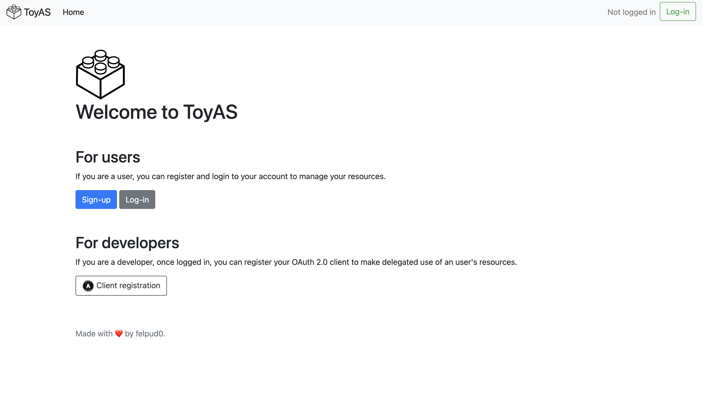
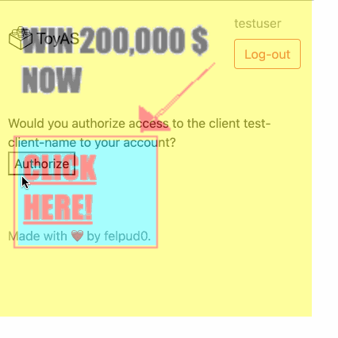

#  ToyAS
ToyAS is a basic OAuth 2.0 Authorization Server (and Resource Server) that simulates an image storage service. 

The main aim of this AS is to debug the OAuth 2.0 flows and 
to provide a way to enable/disable vulnerability protection mechanisms to learn how some vulns can be exploited.
This is obviously imposible to do while testing with real AS such as Google or GitHub as they provide
protection mechanisms. This server uses [authlib](https://authlib.org/) to enforce a correct OAuth 2.0 logic and to use some of the predefined
mixins to store specific OAuth elements.

A demo OAuth 2.0 client is included to test the AS funtionality.




## Execution
1. Clone this repo.
2. User docker-compose to start the AS:
    ```
    docker-compose up
    ```
    or if you want to start the AS and the demo client:
    ```
    docker-compose -f docker-compose-demo.yml up
    ```
4. Launch your browser and type: http://127.0.0.1:80/
5. Click **Log-in** (if you don't want to sign-up) with the default creds: ```testuser```:```testpass```.
6. Click **Images** and upload any.
7. Use the demo client (http://127.0.0.1:5000/) or build a client to use the API (and then register it in the **OAuth 2.0 clients** form).

## API endpoints
 - /api/profile: User's information.
 - /api/images: A list of user's stored images.
 - /api/images/<image_id>: Base64 data of a given image.

## Vuln protection
To enable/disable Clickjacking or URI Redirection protection change vuln_protection_config.py booleans.



